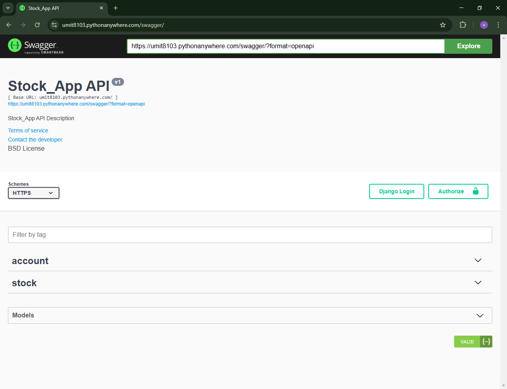
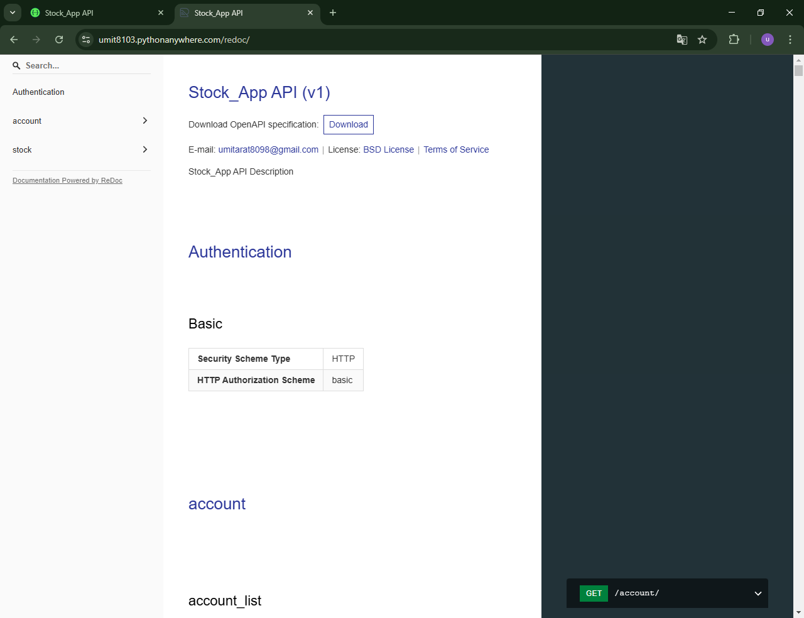
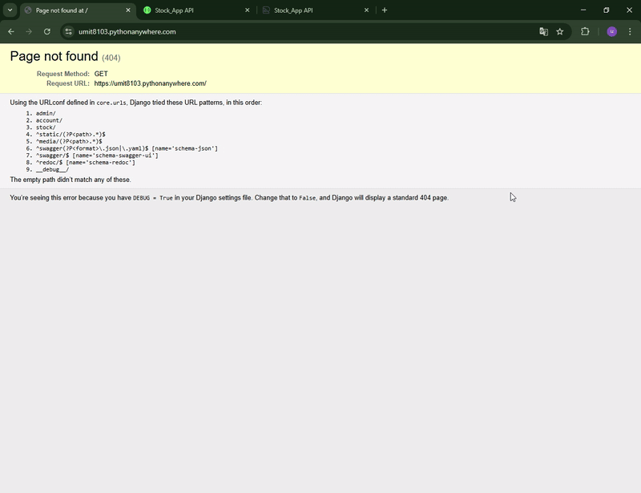
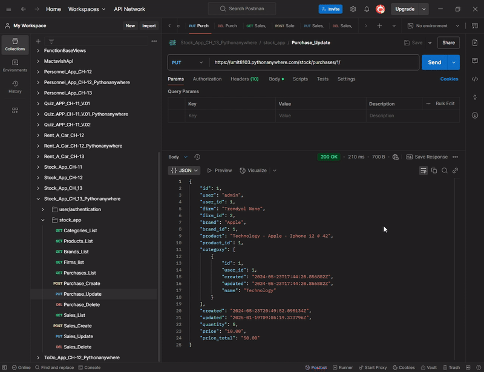
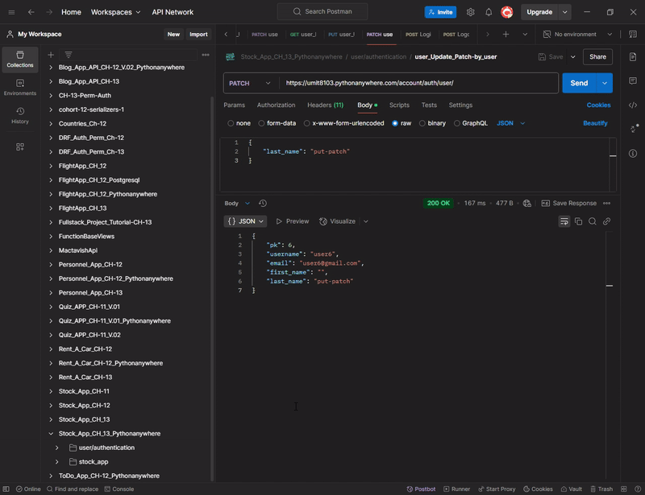
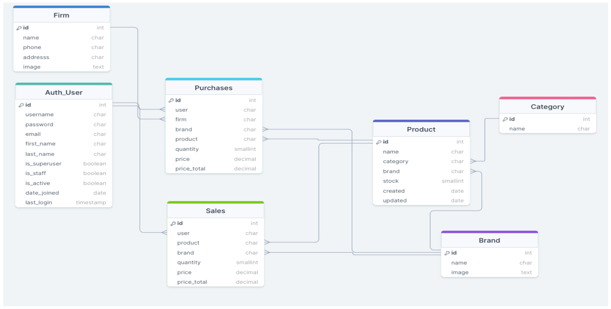

<!-- Please update value in the {}  -->

<h1 align="center">Project_Django_Rest_Framework_Stock_App</h1>

<p align="center"><strong>📦 A modern backend solution that allows users to manage inventory 📦</strong></p>


<!-- <div align="center">
  <h3>
    <a href="https://umit8103.pythonanywhere.com/">
      Demo
    </a>
     | 
    <a href="https://umit8103.pythonanywhere.com/">
      Project
    </a>
 
  </h3>
</div> -->

<!-- TABLE OF CONTENTS -->

## Table of Contents

- [Table of Contents](#table-of-contents)
- [API Documentation](#api-documentation)
- [API Testing](#api-testing)
- [Overview](#overview)
- [Built With](#built-with)
- [How To Use](#how-to-use)
  - [How to Install and Run](#how-to-install-and-run)
  - [Test User Information](#test-user-information)
- [Acknowledgements](#acknowledgements)
- [Contact](#contact)


## API Documentation

You can access the detailed API documentation of the project from the links below:

- [Swagger Documentation](https://umit8103.pythonanywhere.com/swagger/)
<!--  -->

➡ Interface that allows you to easily test API endpoints.

  
- [Redoc Documentation](https://umit8103.pythonanywhere.com/redoc/)
<!--  -->

➡ Documentation tool that presents the API structure in a detailed and organized way.


---

<!-- - Bu dokümantasyonlar sayesinde API endpoint'lerini kolayca test edebilir ve yapılarını inceleyebilirsiniz. -->
**Notes:** You can access Swagger and Redoc documentation without any user login.

**Not:** Swagger ve Redoc dokümantasyonlarına herhangi bir kullanıcı girişi yapmadan erişebilirsiniz.

- Along with Swagger and Redoc documentation, you can use our Postman collection to test APIs. 
  [Stock Management API Postman Collection](https://umit-dev.postman.co/workspace/Team-Workspace~7e9925db-bf34-4ab9-802e-6deb333b7a46/collection/17531143-9c7e9dbb-cadb-4cb7-bb41-7399ad499c3e?action=share&creator=17531143)

## API Testing

To test APIs via Postman, you can follow the steps below:

1. Install Postman (if not installed): [Postman İndir](https://www.postman.com/downloads/).
2. This [Postman Collection](https://umit-dev.postman.co/workspace/Team-Workspace~7e9925db-bf34-4ab9-802e-6deb333b7a46/collection/17531143-9c7e9dbb-cadb-4cb7-bb41-7399ad499c3e?action=share&creator=17531143) Download and import.
3. Start testing APIs via Postman.

**Postman Collection Link:**  
[Stock Management App API Postman Collection](https://umit-dev.postman.co/workspace/Team-Workspace~7e9925db-bf34-4ab9-802e-6deb333b7a46/collection/17531143-9c7e9dbb-cadb-4cb7-bb41-7399ad499c3e?action=share&creator=17531143)


## Overview

Stock App is a modern backend solution that allows users to easily manage stock systems and integrate with API documentation. Main features:

- **CRUD Transactions:** Full data management specific to user and staff roles.
- **API Documentation:** Comprehensive API documentation with Swagger and Redoc.
- **PostgreSQL Support:** High performance database in production environment.
- **Advanced Debugging:** Django Debug Toolbar and system logging support.

---

Stock App, kullanıcıların stok sistemlerini kolayca yönetebilmesini ve API dokümantasyonu ile entegre çalışabilmesini sağlayan modern bir backend çözümüdür. Başlıca özellikler:

- **CRUD İşlemleri:** Kullanıcı ve staff rollerine özel tam veri yönetimi.
- **API Dokümantasyonu:** Swagger ve Redoc ile kapsamlı API dokümantasyonu.
- **PostgreSQL Desteği:** Production ortamında yüksek performanslı veritabanı.
- **Gelişmiş Hata Ayıklama:** Django Debug Toolbar ve sistem loglama desteği.

---

- Project Swagger and Redoc Documentation Visual
<!--  -->

➡ Interface that allows you to easily test API endpoints.

---

- Stock_App testing on Postman
<!--  -->

➡ Screen for testing stock management operations with Postman.

---

- Stock_App User/Authentication Test On Postman
<!--  -->

➡ User verification and authorization test screen.

---

- Stock_App Project ERD Diagram
<!--  -->

➡ ERD diagram showing the application's data model relationships.

---

- API documentation is detailed with Swagger and Redoc. You can access the relevant links via [Swagger](https://umit8103.pythonanywhere.com/swagger/) and [Redoc](https://umit8103.pythonanywhere.com/redoc/).

- Stock Management App is a modern backend application developed for users to manage the stock system and provide easy integration with API documentation.
- Provides CRUD operations specific to users and staff roles.
- Swagger and Redoc were used for API documentation.


## Built With

<!-- This section should list any major frameworks that you built your project using. Here are a few examples.-->

- [Django Rest Framework](https://www.django-rest-framework.org/) - A powerful framework for developing REST APIs.
- [Swagger And Redoc](https://drf-yasg.readthedocs.io/en/stable/readme.html#installation) - API documentation and testing tools. 
- [Debug_Toolbar](https://django-debug-toolbar.readthedocs.io/en/latest/installation.html) - A powerful tool for debugging operations.
- [Logging](https://docs.djangoproject.com/en/5.1/topics/logging/) - System logging modul
- [dj-rest-auth](https://dj-rest-auth.readthedocs.io/en/latest/) - User authentication and authorization. 
- [django-filter](https://django-filter.readthedocs.io/en/stable/) - To facilitate data filtering operations.
- PostgreSQL - High performance database for production environment.


## How To Use

<!-- This is an example, please update according to your application -->

- For online demo: You can take a look at the [Swagger](https://umit8103.pythonanywhere.com/swagger/) and [Redoc](https://umit8103.pythonanywhere.com/redoc/) interfaces.

- To clone and run this application, you'll need [Git](https://github.com/Umit8098/Project_Django_Rest_Framework_Stock_App_CH-13) 

- When installing the required packages in the requirements.txt file, review the package differences for windows/macOS/Linux environments. 

- Complete the installation by uncommenting the appropriate package.

---

- Çevrimiçi demo için: [Swagger](https://umit8103.pythonanywhere.com/swagger/) veya [Redoc](https://umit8103.pythonanywhere.com/redoc/) arayüzlerine göz atabilirsiniz.

- requirements.txt dosyasındaki gerekli paketlerin kurulumu esnasında windows/macOS/Linux ortamları için paket farklılıklarını inceleyin. 

- Uygun olan paketi yorumdan kurtararak kurulumu gerçekleştirin. 

### How to Install and Run

1. **clone the repository:**
    ```bash
    git clone https://github.com/Umit8098/Project_Django_Rest_Framework_Stock_App_CH-13.git
    ```

2. **Create and Activate Virtual Environment:**
    ```bash
    python -m venv env
    env/Scripts/activate (Windows)
    source env/bin/activate (macOS/Linux)
    ```

3. **Install Dependencies:**
    ```bash
    pip install -r requirements.txt
    ```

4. **Update Database with Migrations:**
    ```bash
    python manage.py migrate
    ```

5. **Create the .env File:**  
   Add the necessary settings:
    ```
    SECRET_KEY = "your_secret_key_here"
    ENV = development
    # PostgreSQL
    SQL_DATABASE = your_database_name
    SQL_USER = your_database_user
    SQL_PASSWORD = your_database_password
    SQL_HOST = localhost
    SQL_PORT = 5432
    
    DJANGO_LOG_LEVEL = WARNING
    ```

6. **Run the Application:**
    ```bash
    python manage.py runserver
    ```

Now your application will run at `http://127.0.0.1:8000/`.


### Test User Information

For the live demo, you can use the following test user information:
- **Username:** testuser  
- **Password:** testpassword123  
- **Email:** testuser@gmail.com  

This user can only view inventory and add tasks.


## Acknowledgements
- [Django Rest Framework](https://www.django-rest-framework.org/)
- [Logging](https://docs.djangoproject.com/en/5.1/topics/logging/) - System logging modul
- [Swagger](https://drf-yasg.readthedocs.io/en/stable/readme.html#installation) - Environment and document modul 
- [Debug_Toolbar](https://django-debug-toolbar.readthedocs.io/en/latest/installation.html) - Debug Toolbar modul
- [dj-rest-auth](https://dj-rest-auth.readthedocs.io/en/latest/) - for authentication
- [django-filter](https://django-filter.readthedocs.io/en/stable/)


## Contact

<!-- - Website [your-website.com](https://{your-web-site-link}) -->
- **GitHub** [@Umit8098](https://github.com/Umit8098)

- **LinkedIn** [@umit-arat](https://linkedin.com/in/umit-arat/)
<!-- - Twitter [@your-twitter](https://{twitter.com/your-username}) -->
